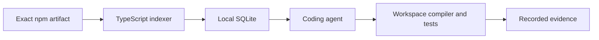

# Apirova

Local API evidence for TypeScript coding agents.

Apirova finds library APIs at an exact npm version, resolves them in your workspace, and records compiler and test results. It runs on your machine through a CLI or an MCP server.

## Philosophy

Know the version. Read the source. Check the workspace. Run the assertions.

An API suggestion starts the work. Evidence completes it. Retrieval, resolution, compilation, and execution are separate results. Missing evidence stays explicit.

## Install

Requires Node.js 22.12 or newer and npm. The SQLite dependency uses a native binary. If a binary is unavailable for your platform, installation requires a working C++ build toolchain.

Download the package from the [latest release](https://github.com/eDimka/apirova/releases/latest), then install it:

```sh
npm install --global ./apirova-0.1.0.tgz
apirova --help
```

To build from source:

```sh
git clone https://github.com/eDimka/apirova.git
cd apirova
npm ci
npm run release:check
npm link
```

## Use it

```sh
apirova add effect@3.22.1
apirova query effect@3.22.1 "How do I retry with exponential delay?"
apirova symbol effect@3.22.1 Effect.retry
```

Inside an npm project, `apirova add effect` uses the exact version from its lockfile when available. `apirova sync` indexes direct locked dependencies.

Configure your agent to start the local MCP server:

```json
{
  "mcpServers": {
    "apirova": {
      "command": "apirova-mcp"
    }
  }
}
```

The six tools cover library search, symbol lookup, feedback, usage statistics, workspace context, and workspace validation. See [usage](docs/USAGE.md) for request examples.

## How it works



Package downloads verify registry integrity and do not run package lifecycle scripts. Once indexed, search works offline. Workspace checks use the project’s installed TypeScript compiler. [Architecture](docs/ARCHITECTURE.md) explains the boundaries.

## Benchmarks

The release includes executable retrieval cases and workspace fixtures with pinned package versions. Reports retain the questions, expected symbols, returned results, and execution evidence.

```sh
npm run benchmark
npm run prove:support
```

The initial release records 73 of 73 discovery hits, 70 of 73 strict retrieval cases, 24 of 24 workspace scenarios, and 48 of 48 negative controls.

These are authored development regression suites. Their results describe the supplied cases. Read the [benchmark methodology and results](docs/BENCHMARKS.md).

## Local data

Indexes and query history live in `~/.apirova`. Set `APIROVA_HOME` to change the directory. Set `APIROVA_USAGE=off` to disable query and validation recording. The application does not upload query history. Building an index requires access to npm.

Workspace validation runs a test command only when it is supplied explicitly. That command executes local code with your permissions. See [security](SECURITY.md).

## Scope

The MVP supports npm packages with TypeScript declarations or usable TypeScript sources, npm lockfiles, and local TypeScript projects. Workspace resolution uses the TypeScript language service directly. Test evidence covers the supplied assertions and recorded input scope. Hosted distribution, other languages, and coordinated changes across repositories are outside this release.

[Contributing](CONTRIBUTING.md) · [Release checks](docs/RELEASE.md) · [MIT license](LICENSE)
