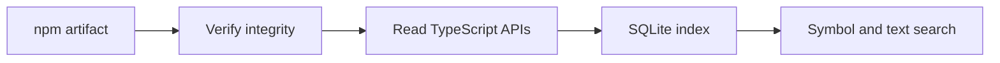

# Architecture

Typelatch has two paths: package discovery and workspace evidence. The CLI and MCP server call the same core functions.

## Package discovery

`npm.ts` resolves and downloads one artifact. `archive.ts` bounds extraction. `indexer.ts` reads exports, declarations, documentation, examples, and relationships. `database.ts` stores the result atomically. `query.ts` combines exact lookup, text search, status signals, and relationships.

Package identity is the name, exact version, and registry integrity. An index is reusable across projects. The registry hash establishes the downloaded artifact identity; workspace artifact equivalence remains a separate question.

New package builds use the trimmed format. It retains signatures, documentation, source locations, symbol identities and relationship endpoints while omitting raw implementation text and unused edge evidence. Existing baseline and compact indexes remain readable. Rebuild an existing package with `typelatch add name@version` to use the smaller format.

## Workspace evidence

`workspace/search.ts` is the entry point for discovery without a known file or package. `workspace/inventory.ts` gathers Git selected workspace text, project manifests, configs, and exact installed or locked dependency identities. `lockfiles.ts` selects and parses supported npm, pnpm, Yarn and Bun text formats for both project commands and workspace inventory. `project.ts` resolves lock ownership for both sync and search. `sync.ts` expands the selected projects and prepares a complete plan before downloads. The plan records exact identities, project and lockfile provenance, cache status, skips and errors. Lock candidates remain distinct from installed identities. `workspace/search-index.ts` updates a separate SQLite text index by content hash and extracts local declaration positions with the bundled TypeScript parser. It does not load the project compiler. Package indexes retain their existing artifact identity and format.

`scope.ts` persists an explicit project selection in `.typelatch/scope.json`. Plain sync and every search inventory reload the nearest configuration. Source inventory intersects the selection with the requested root before Git enumeration or filesystem traversal. Scoped dependency discovery resolves only selected projects' direct declarations, including hoisted installations and shared locks. Ancestor metadata and Yarn Classic member manifests used for local identity never opt more source into the index. An empty selection remains empty; invalid selections fail. The existing cache transaction removes excluded files and reuses unchanged selected files. Global package indexes are retained when the selection contracts.

Workspace and dependency candidates receive a shared lexical score based on content, rather than comparing the existing package rank numbers. Results expose bounded retrieval, inventory gaps, exact locations, and separate evidence states. CLI and MCP discovery run in a separate `search-worker.ts` process through the existing bounded worker queue, so synchronous indexing cannot block the server from enforcing cancellation and deadlines. The existing workspace context and validation paths remain responsible for compiler and execution evidence. Workspace cache transactions keep index refresh and candidate selection together; the filesystem reads themselves are not an atomic snapshot.

Workspace cache schema 6 stores excerpt offsets and lengths and refers to file paths by numeric identity. A contentless FTS index holds search postings without storing excerpt text. Search reconstructs excerpts from the same content inventory whose hashes were checked for that request, including unchanged files. Older caches rebuild from current file contents and reclaim obsolete pages. File content hashes, ranking weights, candidate limits and source locations retain their existing meaning.

`workspace/context.ts` resolves the installed project and joins optional package discovery. `workspace/persistent.ts` reuses compiler processes while checking file and configuration identity. `workspace/runtime.ts` bounds requests. `workspace/validate.ts` combines compiler results, explicit command execution, and input snapshots.

Workspace search also reuses a worker within a session. It inventories and hashes current files on every request; only process and parser startup are reused. Search and context share a pool with at most two workers and sixteen queued requests. Cancellation and deadlines terminate the process group, output remains bounded, and idle workers retire after thirty seconds. Reuse retains the parser runtime in memory during that idle interval. Standalone CLI requests can exit without waiting for it.

`workspace/command.ts` enforces time and output limits. `workspace/snapshot.ts` records the scoped input identity. Cancellation and missing results stay visible. A retrieved symbol, a resolved symbol, a successful compile, and passing assertions each carry their own evidence.

## Interfaces

`cli.ts` handles local commands. `mcp.ts` exposes seven tools over standard input and output. `workspace/schema.ts` validates workspace requests. `usage.ts` stores optional local library query history and feedback. Workspace discovery caches source excerpts separately and does not emit library feedback IDs. Tool executed validation records remain separate from agent reported outcomes.

## Boundaries

The installed compiler and explicit test commands are trusted local code. Snapshots describe the recorded files and configuration. They do not certify remote systems or excluded inputs. Each leaf project can be validated; references inform resolution. This release does not implement an LSP transport or a remote service.
