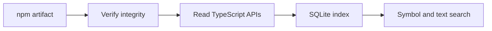
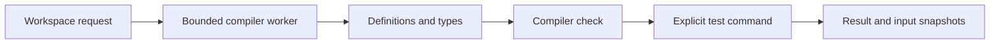

# Architecture

Typelatch has two paths: package discovery and workspace evidence. The CLI and MCP server call the same core functions.

## Package discovery

`npm.ts` resolves and downloads one artifact. `archive.ts` bounds extraction. `indexer.ts` reads exports, declarations, documentation, examples, and relationships. `database.ts` stores the result atomically. `query.ts` combines exact lookup, text search, status signals, and relationships.

Package identity is the name, exact version, and registry integrity. An index is reusable across projects. The registry hash establishes the downloaded artifact identity; workspace artifact equivalence remains a separate question.

## Workspace evidence

`workspace/context.ts` resolves the installed project and joins optional package discovery. `workspace/persistent.ts` reuses compiler processes while checking file and configuration identity. `workspace/runtime.ts` bounds requests. `workspace/validate.ts` combines compiler results, explicit command execution, and input snapshots.

`workspace/command.ts` enforces time and output limits. `workspace/snapshot.ts` records the scoped input identity. Cancellation and missing results stay visible. A retrieved symbol, a resolved symbol, a successful compile, and passing assertions each carry their own evidence.

## Interfaces

`cli.ts` handles local commands. `mcp.ts` exposes six tools over standard input and output. `workspace/schema.ts` validates workspace requests. `usage.ts` stores optional local query history and feedback. Tool executed validation records remain separate from agent reported outcomes.

## Boundaries

The installed compiler and explicit test commands are trusted local code. Snapshots describe the recorded files and configuration. They do not certify remote systems or excluded inputs. Each leaf project can be validated; references inform resolution. This release does not implement an LSP transport or a remote service.
